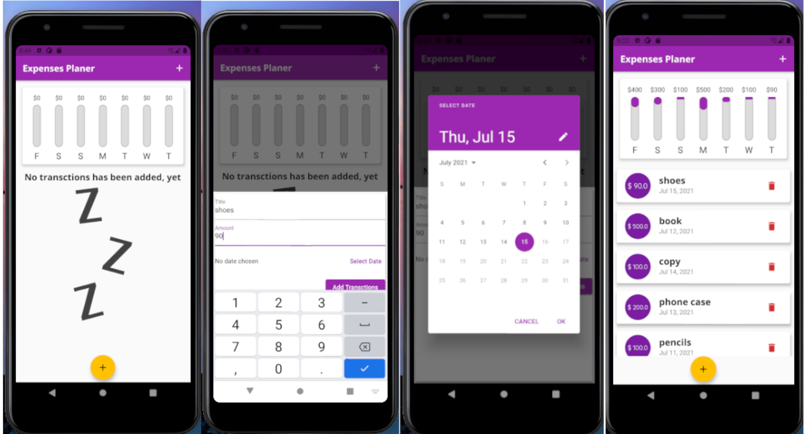

# Expanses Tracker (notes all your daily spending in this app)

Expenses Tracker is the flutter mobile app where user can add their spanding of a week.
Chart shows percentage of amount spend in that day by total amount spend in a week.
Transtions can be added in different date and deleted also.

## [View in Web](https://subash9860.github.io/expenses_planer/#/)

### [Click here for web view](https://subash9860.github.io/expenses_planer/#/)
 Note: for bettter look in browser, make it size of 370 x 640 becuase it is only made for Mobile view only, not for web view.

### Snapshot

## Thank you for visiting 
